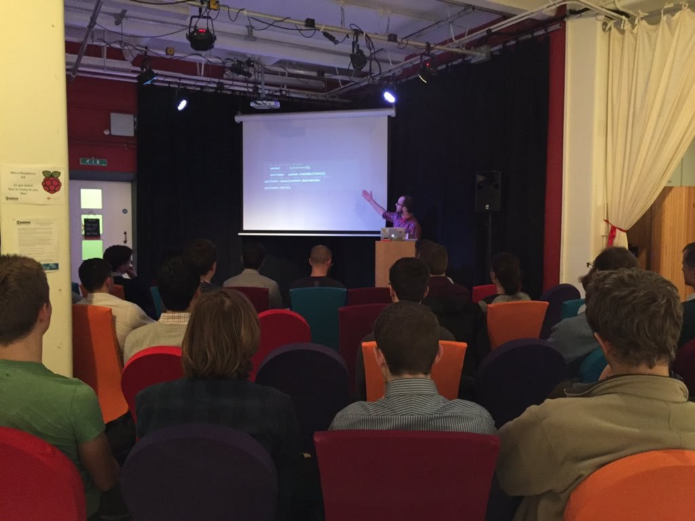
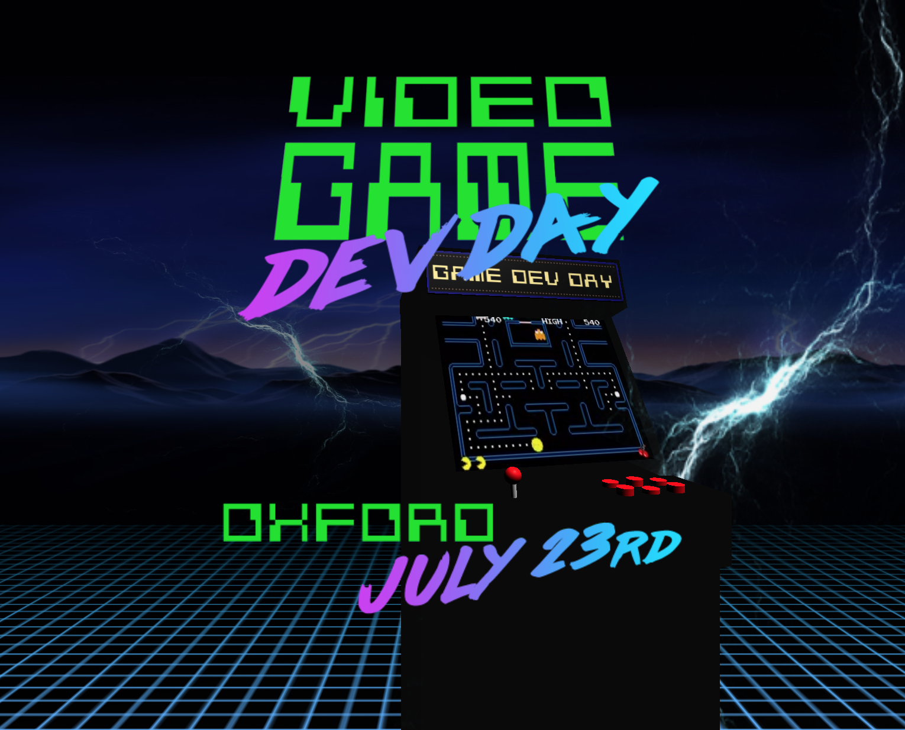
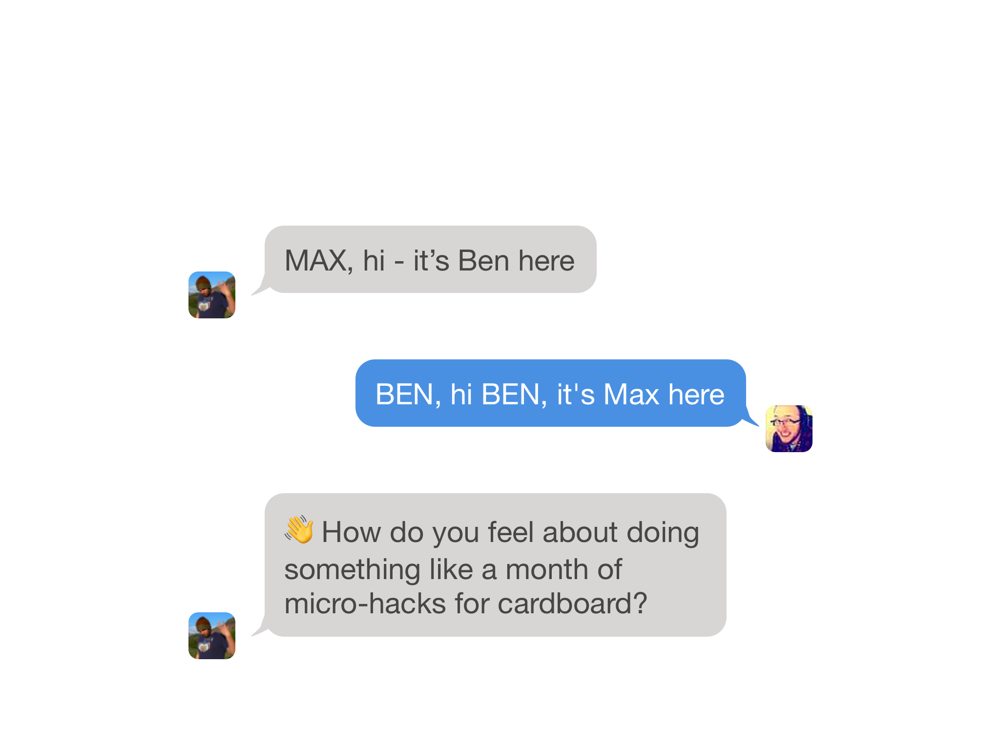
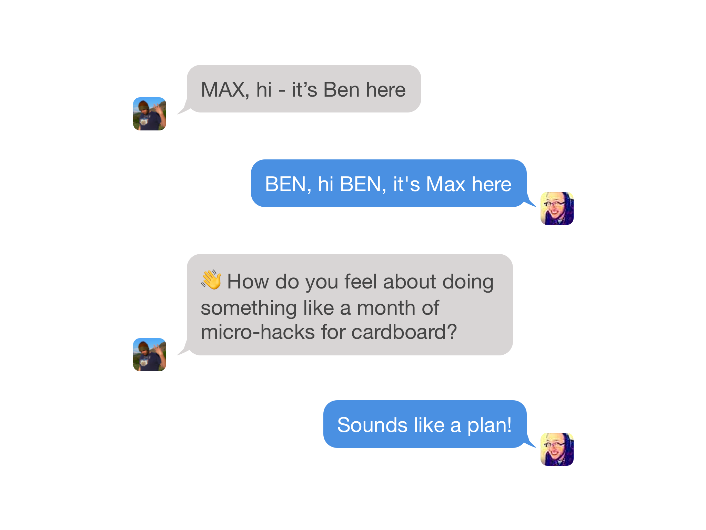

---

# Hello!
# [fit] I'm Max Glenister
# [fit] UX/Front-end developer at Aris

---

# [fit] 20 Minutes into the Future
# [fit] with Google Cardboard and Javascript

---

# [fit] Since then...

---

# [fit] UX of VR
# [fit] _*http://www.uxofvr.com*_

---

# [fit] Game Dev Day
# [fit] _*http://gamedevday.club*_

---

## Messing with VR stuff is a passion of mine...

---

# Today

---

# [fit] Doing something
# [fit] every day for a month

---

---

---

---

---

# [fit] Cardboctober

---

# [fit] The plan

---

# [fit] Every day in October we'll
# [fit] create a little something
# [fit] for Google Cardboard
# [fit] using JavaScript

^ so that evening I threw together a website, and then the next day we announced our plan at JS Oxford - so backing out was not an option!

---

... and we even managed to convince others to take part!

---

# [fit] Planning
# [fit] a month of work

^ We each had our own approaches, but this is how I did it

---

# [fit] Break it down
# [fit] into chunks

^ A month can be quite daunting, so I roke th emonth down into 1-week chunks

---

# [fit] Week 1: Basic VR

---

# [fit] Week 1: Basic VR
# [fit] Week 2: Web APIs

---

# [fit] Week 1: Basic VR
# [fit] Week 2: Web APIs
# [fit] Week 3: UX of VR

---

# [fit] Week 1: Basic VR
# [fit] Week 2: Web APIs
# [fit] Week 3: UX of VR
# [fit] Week 4: Make a game

^ And then each week I broke it down into daily chunks. Each day I created a hack, and then I wrote a blog post to explain it

---

# [fit] This is great for
# [fit] content creation

^ I went from writing around 15 blog posts a year to writing over 30 in one month.

---

technology

---

three.js

---

challenges

---

so what did I make?

---

// show each thing with a gif

---

what's next?

---

cardvember?
cardcember?
carduary?

---

