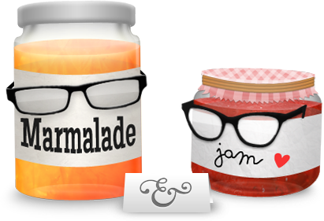
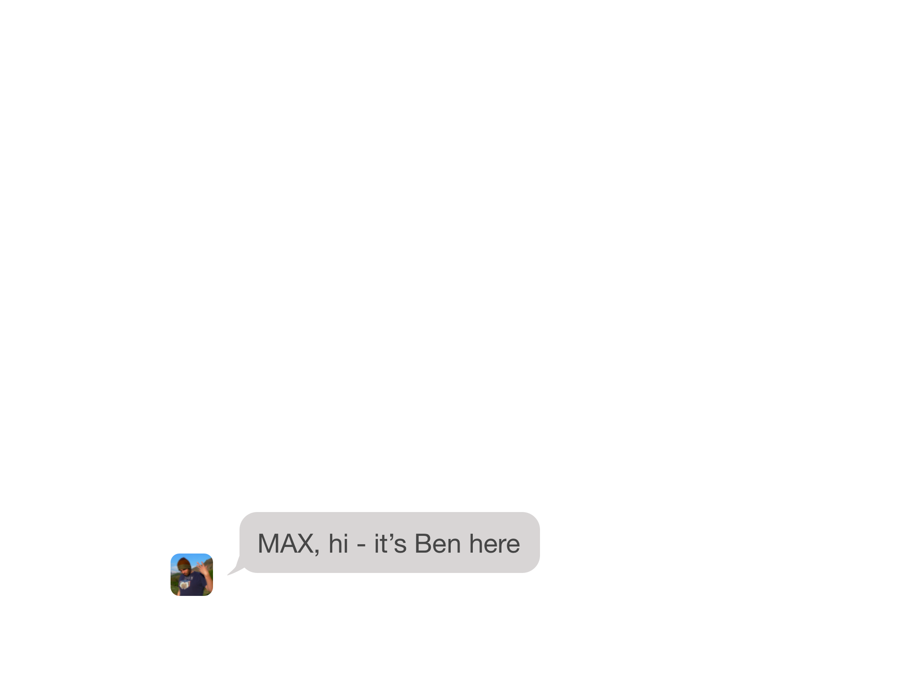

theme: ostrich,6

# Hello

^ Hello... Surprise! I'm up here again talking about VR and Javascript.

---
###[fit] omgmog.net
###[fit] blog.omgmog.net
###[fit] Twitter/Github/Slack @omgmog

^ I'm Max Glenister. If you don't know me already, you can find out more at any of these places or pay attention for the next couple of slides.

---
## UX/Front-end Developer
### Aris Technologies

^ For my day job I work for a company called Aris where I design and build the UI for online casino games.

---

# Marmalade & Jam

^ I also run a web design company with my wife Jenny, where I mostly design and build websites for pubs and other small businesses.

---
## I also like to
## play with VR

^ If I find myself with any free time I like to play with VR. <br>I've been messing around with VR stuff for nearly two years now

---

### 20 minutes into the future
###[fit] with Google Cardboard and JavaScript
### *omgmog.net/talk20mins*

^ I gave a talk this time last year called "20 minutes into the future" where I explained how you can use JavaScript to make Google Cardboard experiences. <br>If you missed it, you can check out the video and write-up on my website.

---

## UX of VR
### *uxofvr.com*
^ Shortly after that I created uxofvr.com which is a curated list of articles and resources for learning how to apply the best UX in your VR projects.

---

## Game Dev Day
### Summer of Hacks 2016

^ At this year's Summer of Hacks, I co-organised Game Dev Day with Pete. <br>I encouraged people to create VR hacks!

---
## And then in <br>September
^ After the summer I was looking for another VR project to work on and then Ben sent me a message

---


^ Hey Max

---


^ Hey Ben

---


^ Do you fancy doing a month of google cardboard hacks?

---


^ And so with two days until it began, the idea of Cardboctober was born.

---

# Cardboctober
^ I built a website and we announced Cardboctober at September's JS Oxford. <br>At this point we managed to convince Pete to take part too.

---
## 31 days
### of making things
### for Google Cardboard
^ The plan was simple, we would make something small for Google Cardboard each day for the month of October

---

## **EASY MODE**
### **join in sometimes**

^ We encouraged others to participate.

---

## **REGULAR MODE**
### **join in every day**

^ Pete and Ben planned to just make something each day

---

## **HARD MODE**
### **all of above & blog daily**

^ I decided it would be fun to make something each day and also blog about it.

---
## I made some
## cool things

^ and in the end I made some pretty cool things

---


^ Including a pairs game, a beat sequencer, and a vr cinema. <br>I'll talk about these more a bit later

---
## And so did
## other people

^ Pete and Ben also made some cool things...

---


>By @peterjwest

^ Pete's hacks were polished, and brought together some complex maths and cool interaction techniques.

---


>By @benfoxall

^ Ben's hacks were quite abstract, and I think he wrote a 3D renderer from scratch or something crazy rather than just using Three.js like me and Pete.

---
## Check them out
### *cardboctober.xyz*

^ You should check them out if you didn't follow Cardboctober as it happened <br>all of the hacks will work in Chrome on most Android devices, and will probably work in Safari on iPhones

---
## How did <br>I do it?

^ 31 days of making stuff is a lot of work. So how did I do it? Well, for me it began with a lot of planning...

---


^ I made a spreadsheet, and in that I broke the month down in to themed weeks, and then each week in to a project per day. <br>This really helped to stop Cardboctober seeming like a huge undertaking.

---
### Week 1
## Basic VR

^ In the first week I covered Basic VR.

---

## VR
### for dummies

^ Getting started with VR is really easy. Here's a quick guide...

---
```html
<html>
  <body>
    <script src="three.min.js"></script>
    <script>
      // !
    </script>
  </body>
</html>
```

^ First you need to create an HTML page and load three.js

---
```javascript
// Setup the camera, renderer, scene, etc.

// Make a cube
var geometry = new THREE.BoxGeometry(1,1,1);
var material = new THREE.MeshBasicMaterial({
  color: 0xff0000
});

var cube = new THREE.Mesh(geometry,material);

scene.add(cube);
```

^ Then as you do with any Three.js project, setup your camera, renderer, scene, etc. <br>Then you could define a cube mesh and add it to your scene.

---
```javascript
var update = function () {
  cube.rotation.x += .1;
  cube.rotation.z += .1;

  renderer.render(scene, camera);
  requestAnimationFrame(update);
};

// Call it once to begin
update();
```

^ Using request animation frame we can animate the scene, for this example we're rotating the cube we've created on it's axis.

---


^ Here's one I made earlier.

---
## That's not VR
### That's just a spinning cube!

^ You may have noticed that this isn't VR. <br>Three.js comes with a plugin called "stereo effect" that will automatically create a side-by-side stereoscopic view of our scene so that we can use it in VR with Google Cardboard.

---
```html
<html>
  <body>
    <script src="three.min.js"></script>
    <script src="StereoEffect.js"></script>
    <script>
      // !
    </script>
  </body>
</html>
```

^ Just load the StereoEffect plugin in your HTML page

---
```javascript
// After setting up your renderer
effect = new THREE.StereoEffect(renderer);
effect.eyeSeparation = 1; // Set the IPD
effect.setSize( width, height );

// Instead of calling
// renderer.render(scene, camera)
effect.render(scene, camera)
```

^ Then initialise it after your renderer, and call it inside your update function

---


^ And that's it. You've now got a stereoscopic scene. You've got VR. <br>The way this works is both halves of this image are slightly different, and each is only seen by one eye.

---


^ Besides rendering in stereo, you can use the orientation of your device to give you basic head tracking so that you can look around in VR too. <br>But I don't have the time to cover that tonight.


---
## :boom: :package: 🕶 :boom:
###<br>
### blog.omgmog.net

^ Don't worry about remembering all of this, as with everything else I'm talking about this evening, you can find how to do this in more detail on the cardboctober section of my blog.

---
>Raycasting
>Skyboxes
>Textures
>Mesh generation
>Using .stl models
>and...

^ In week 1 I also covered some other things... raycasting to determine where you're looking or what you're looking at <br>skyboxes to provide a nice backdrop for your scene <br>loading textures and generating 3D meshes so you can create more than just red boxes <br>using pre-made models such as storm troopers and not the droid's you're looking for and lastly...

---


^ a pairs game that pulled together all of the concepts from week 1. <br>In this game, you look at a tile to flip it and see the image, and then you've got to find the matching tile to create a pair. <br>This makes use of Marcus' Benholder repository of Bens faces. Thanks Marcus.

---
### Week 2
## HTML5 Web APIs

^ For week 2 I decided to look at using Web APIs.

---
>Video
>Playing sounds
>Speech recognition
>Zombie Survival

^ Web browsers can do lots of cool stuff these days, such as playing video and audio without plugins and speech recognition. <br>I decided to try and put some of these web APIs to use. <br>Here are some of the things I made in Week 2.

---


^ I created a vr cinema to showcase playing video. <br>In this hack I'm extracting the dominant colors from each frame and using them to light the scene. <br>Unfortunately, I found that rendering video in 3D and extracting colors from each frame really made my phone choke, but it ran nicely on my PC!

---


^ I built a beat sequencer to showcase playing audio. <br>In this hack you're surrounded by 200 degrees of sound board, where you can pick the sounds to play in a sequence by looking at a square on the board and tapping the screen. <br>Behind you are some controls to pause and reset the sequencer.

---


^ I decided to make something that uses Speech recognition as an input method. <br>In this hack I set up a bunch of commands such as "move forward" and "move left". <br>You tap the screen and the microphone starts listening for your command, once it matches a command the ball moves around in 3D space. You can even ask it to tell you a joke.

---


^ Zombie survival wasn't so much a use of web apis -- I just got frustrated trying to make a demo that used the gamepad API. <br>The zombies move towards the player and when they get too close you take damage until you die. You can move around by looking at the area you wish to move to and tapping the screen to teleport there.

---
### Week 3
## UX of VR

^ For the third week I focussed mainly on writing VR UX articles rather than creating hacks...

---


^ Because I was on holiday

---
>The UX of quick <br>Google Cardboard hacks

^ I started by writing about the UX of quick google cardboard hacks

---


^ You might have seen some variation of this chart before. This is Maslow's hierarchy of needs, applied to virtual reality.<br>Comfort is the most important need, all the way through to delight. <br>If you can nail comfort and interpretability the idea is you can make the user feel like they're actually present in VR.<br>Everything else above that is a bonus.

---


^ There are obviously comfort hurdles with Google Cardboard already... there isn't usually a headstrap; the lenses aren't great; your phone can't maintain a smooth framerate. <br>If you're thinking up and creating something in one day it's probably not going to be very useful, but it can be delightful.<br>So I decided this was all that matters when you've got 2 hours a day to ship something.

---
>Getting in and out of Fullscreen
><br>
>Moving around in VR
><br>
>Which way is North?

^ These are some of the other bits I wrote about for the rest of the week. <br>As I worked out my ideas for things such as entering fullscreen or determining where North is, I applied the learning retroactively to all of my cardboctober hacks. <br>These posts were not very demo-heavy, so they're not worth showing here tonight but if you want to know more you can go and read them on my blog.

---
### Week 4
## The big project

^ For the last week of Cardboctober, I decided it would be a good idea to do a big week-long project

---


^ So I embarked on building Tetris in VR

---


^ I figured it would be a good project as it would bring together a lot of the things I had been working on all month... mesh generation, raycasting, using sounds...

---


^ Unfortunately, and perhaps appropriately I hit a wall and couldn't get past things such as the collision detection when applying Tetris to VR. <br>Annoyingly I burned a couple of days writing and re-writing my implementation.

---


^ In hindsight creating Tetris in just 2-hour blocks over a week was over-ambitious, so I gave up on that and threw my blocks out of the pram and decided to do something else instead.

---


^ I built a visualisation of my github contributions. <br>This takes the data that Github uses to build that cool little grid on your Github profile, which by the way is only available as SVG rather than as a nice API endpoint. <br>I mangled the SVG a bit to make it usable as a data source and generated a nice circular grid with the data. <br>You can see my streak there for October 2016.

---


^ for the last day of Cardboctober and Halloween, I built a creepy spider and made it crawl around in the shadows just out of reach.

---


^ look at the cute little guy! he's built using just spheres and cylinders.

---
## What have
## I learned?

^ So now that Cardboctober is over, what have I taken away from the experience?

---
## Doing something<br>every day for a<br>month is hard

^ Doing something every day is hard. <br>Motivation aside, life will always throw something in the way. <br>Planning upfront and doing work to get yourself ahead of the curve during the busy times will make the whole process a lot easier.<br>If you're doing something mental like creating a hack and a blog post each day, focus on getting the hack out first and don't worry about being a little late with the blog post.<br>If what you write is total crap you can always come back to it later.

---
## I've learned <br>lots about <br>VR and 3D

^ Even though my hacks were quite simple, I feel like I've learned a lot. <br>The nice thing about doing a month of hacks with other people is the option to rebound and discuss ideas. <br>Pete did some cool stuff with using a raycaster to move one day, and then I stole it from him the next day. <br>I still don't quite know what a quaternion is but I think I used one in a couple of places.

---
## Save time/sanity <br>by factoring out common code.

^ Save time and your sanity by factoring out common code. <br>I decided early on to create a "core.js" file. <br>This contained functions that setup the boilerplate for a three.js scene, and I also created some functions to wrap around common tasks like building meshes. <br>If you're interested, check out my "three-skeleton" repository on Github.

---
## Test your ideas often, and on other people

^ Test your ideas often, and on other people. <br>It's good to get a second or third perspective. <br>People experience things differently, what works for your eyes might not work for other people, it's hard to have a helicopter view of something you've been staring at for 3 hours late at night.

---
## Don't worry about making it perfect

^ Don't worry about making it perfect. <br>These are quick hacks so you can't be precious. <br>There aren't enough hours in the day. <br>You can forgo your unit tests and extensive cross-device testing. <br>Just make something, make it work, and ship it. You can always come back to it later.

---
## If you're learning <br>from it then others <br>can learn too

^ If you're learning from it then others can learn too. <br>On this note, as I've already mentioned I blogged every day through Cardboctober, and now these posts are conveniently located in one place on my blog. <br>If you're looking to make something with JavaScript for Google Cardboard I'm sure it will be a useful resource for you.

---
# Final numbers

^ Let's take a look at some numbers. <br>I was going to have a breakdown of the commits per person, per repository here, and total lines of code but because Pete used webpack and gulp and he and Ben haven't heard of sharing common code between hacks it was hard to get accurate numbers.

---
## Max: 31 hacks

^ I managed to do a hack and a blog post every day. <br>There were a couple of times where I got 1 or 2 days behind, but I still pushed _something_ to Github and then caught up.

---
## Pete: 31 hacks

^ Pete did pretty well, though he was still pushing code in November.

---
## Ben: 18 hacks

^ Well, Ben only officially published 16 but he has 18 up on Github. <br>It turns out he's a much busier man than me and Pete.

---
## In conclusion

^ Cardboctober was a really fun month, I learned a lot and it was great pushing myself to create something new each day. <br>If you wanted to do something like this every day for a month, you should. No matter what it is that you're doing, if you do it for 31 days you will get something out of it.<br>Since the end of Cardboctober I've been enjoying...

---

#[fit] Nocodevember

^ I've not made any new VR stuff in November and my wife is happy about that but I recently bought a HTC Vive so I'm playing with that whenever I can.

---
# [fit] Thanks
### [fit] cardboctober.xyz

^ any questions?

