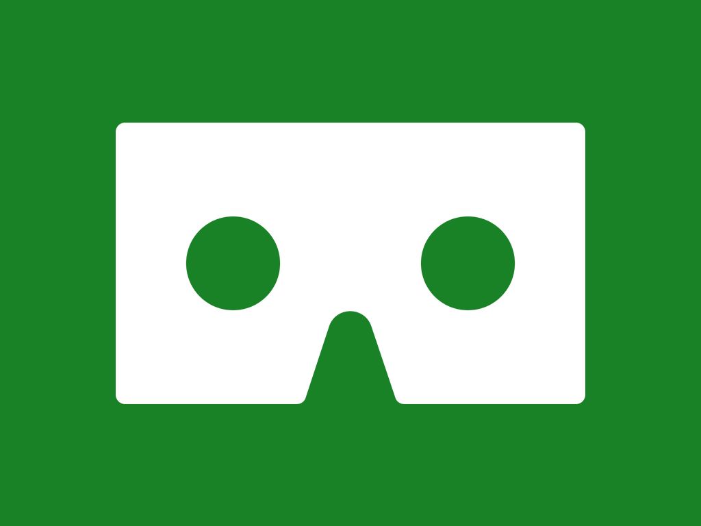
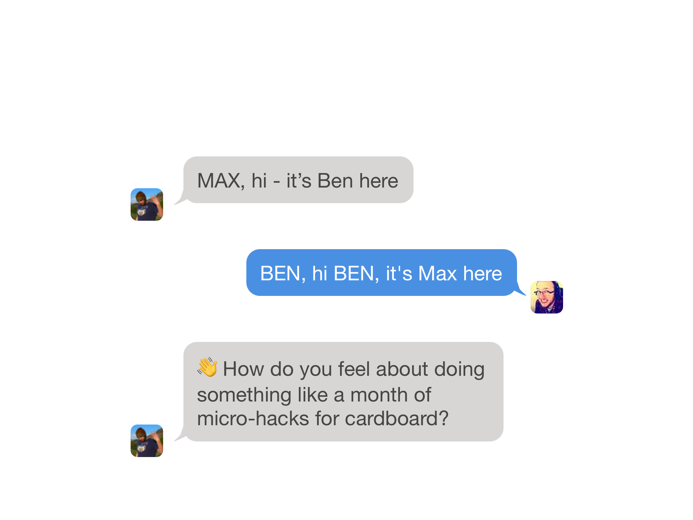

theme: ostrich,6

# Hello
## I'm Max Glenister

^ Hello, I'm Max Glenister

---
### omgmog.net
### blog.omgmog.net
### @omgmog on Twitter/Github

^ If you know me already, it's probably through one of these places

---
## UX/Front-end Developer
### Aris Technologies
#### \(we make online casino games)

^ For my day job I work at Aris where I design and build the UI for casino games.

---
## Web designer/developer
### Marmalade & Jam
#### \(we mostly make websites for pubs)

^ I also run a web design company with my wife, where I mostly seem to make websites for pubs and other small businesses.

---
## I like to
## dabble with VR

^ If I find myself with any free time I like to dabble with VR. I've been messing around with VR stuff for nearly two years now

---

### 20 minutes into the future
###[fit] with Google Cardboard and JavaScript
### *omgmog.net/talk20mins*

^ Infact, I gave a talk this time last year called "20 minutes into the future", where I explained how you can use JavaScript to make Google Cardboard experiences. If you missed it, you can check out a video and write-up on my website

---

## UX of VR
### *uxofvr.com*
^ Shortly after that I created uxofvr.com -- a curated list of articles and resources for learning/applying good UX in your VR projects.

---

## Game Dev Day
### Summer of Hacks 2016
^ Most recently, this summer for the JS Oxford Summer of Hacks, I organised Game Dev Day. I encouraged people to create VR hacks!

---
## After that...
^ So after that I was looking for another VR project to work on

---
## And then in September
^ Then in September, Ben Foxall sent me a message on the Digital Oxford Slack

---


^ Hey Max

---


^ Hey Ben

---


^ Do you fancy doing a month of google cardboard hacks?

---


^ Sure.

---

# Cardboctober
^ And so with two days until it began, the idea of Cardboctober was born

---
## 31 days
### of making things
### for Google Cardboard
^ The plan was simple, we would make something small for Google Cardboard each day for the month of October

---

## **EASY MODE**
### **join in sometimes**

^ We encouraged others to participate, but unsurprisingly few took part.

---

## **REGULAR MODE**
### **join in every day**

^ Ben and Pete planned to just make something each day

---

## **HARD MODE**
### **all of above & blog daily**

^ I decided it would be fun to make something each day and also blog about it.

---
## I made some
## cool things...

^ and I think I made some pretty cool things

---


^ Including a pairs game, a beat sequencer, and a vr cinema. I'll touch on some of these more a bit more later

---
## And so did
## other people

^ Ben and Pete also made some cool things...

---


>By @benfoxall

^ Ben's hacks were quite abstract, and I think he wrote a 3D renderer from scratch or something crazy.

---


>By @peterjwest

^ Pete's hacks were polished, and brought together some complex maths and cool interaction techniques.

---
## Check them out
### cardboctober.xyz

^ You should check them out if you didn't follow Cardboctober as it happened, all of the hacks should work in Chrome on Android on devices with a gyroscope, and will probably mostly work in Safari on iPhones

---
## How did I do it?

^ 31 days of making stuff is a lot of work. So how did I do it? Well, for me it began with a lot of planning...

---


^ I made a spreadsheet, in that I broke the month down in to themed weeks, and then each week in to a project per day. This really helped stopping Cardboctober seeming like an overwhelming undertaking.

---
### Week 1
## Basic VR

^ for the first week I covered Basic VR.

---

## VR for dummies

^ For example, here's how you can get up and running with VR using JavaScript and Google Cardboard

---
```html
<html>
  <body>
    <script src="three.min.js"></script>
    <script>
      // !
    </script>
  </body>
</html>
```

^ First you need to create a HTML page and load three.js

---
```javascript
// Setup the camera, renderer, scene, etc.

// Make a cube
var geometry = new THREE.BoxGeometry(1, 1, 1);
var material = new THREE.MeshBasicMaterial({color: 0xff0000});
var cube = new THREE.Mesh(geometry, material);
scene.add(cube);
```

^ Then just setup your camera, renderer, scene, etc. as you do with any Three.js project. Then define a cube and add it to your scene.

---
```javascript
var update = function () {
  cube.rotation.x += .1;
  cube.rotation.z += .1;

  renderer.render(scene, camera);
  requestAnimationFrame(update);
};

// Call it once to begin
update();
```

^ Using request animation frame we can smoothly animate the scene, for example we could rotate the cube we've created on it's axis.

---
# Here's one I made earlier


^ Here's one I made earlier.

---
## But Max<br>that's not VR
#### That's just a spinning cube!

^ Oh right yes

---


^ VR needs to be 3D. So how about that? Luckily for us, three.js comes with a plugin called "stereo effect" that automatically creates a side-by-side stereoscopic view of our scene

---
```html
<html>
  <body>
    <script src="three.min.js"></script>
    <script src="StereoEffect.js"></script>
    <script>
      // !
    </script>
  </body>
</html>
```

^ Just load the StereoEffect plugin in your HTML page

---
```javascript
// After setting up your renderer
effect = new THREE.StereoEffect(renderer);
effect.eyeSeparation = 1; // Set the IPD
effect.setSize( width, height );

// Instead of calling renderer.render(scene, camera) in update()
effect.render(scene, camera)
```

^ Then initialise it after your renderer, and call it inside your update function

---


^ And that's it. That's the basics.

---
#[fit] :boom: :package: 🕶 :boom:

^ You're now a VR expert.

---
#[fit] :boom: :package: 🕶 :boom:
### blog.omgmog.net

^ Don't worry about remembering all of that, as with everything else I'm talking about this evening, you can find how to do this in more detail on the cardboctober section of my blog.

---
>Raycasting
>Skyboxes
>Textures
>Mesh generation
>Using .stl models
>and...

^ In week 1 I also covered some other things... raycasting (to determine where you're looking), skyboxes, loading textures, generating 3D meshes, using pre-made models and...

---


^ a pairs game that pulled together all of the concepts from week 1

---
### Week 2
## HTML5 Web APIs

^ For week 2 I decided to look at using Web APIs. Web browsers can do lots of cool stuff these days, such as speech recognition or playing video/audio without plugins

---
>Video
>Playing sounds
>Speech recognition
>Zombie Survival

^ So I decided to try and put some of these web APIs to use

---


^ I created a vr cinema to showcase Video playback in a scene. In this hack I'm extracting the dominant colors from each frame and using them to light the scene. Unfortunately, rendering video in 3D and extracting colors from each frame really made my phone choke.

---


^ I built a beat sequencer to showcase playing sounds. It uses a selection of sounds for various instruments and was actually an adaptation from something I had done in 2D a couple of months ago.

---


^ I decided to make something that uses Speech recognition as a controller input. In this hack I set up a bunch of commands such as "move forward", "move left" and "tell a joke".

---


^ Zombie survival. Well this wasn't so much a use of web apis -- I just got frustrated trying to make a demo that used the gamepad API, and so decided to make this instead. The zombies move towards the player and when they get too close you die. You can move around by looking at the area you wish to move to and tapping the screen.

---
### Week 3
## UX of VR

^ For the third week I focussed mainly on writing VR UX articles rather than creating demos...

---


^ Because I was on holiday

---


^ In the Lake district.

---
>The UX of quick Google Cardboard experiences

^ For example I wrote about the UX of quick google cardboard experiences

---


^ You might have seen some variation of this chart before

---


^ I decided this was all that matters when you've got 2 hours a day to ship something quick and dirty.

---
>Getting in and out of Fullscreen
><br>
>Moving around in VR
><br>
>Which way is North?

^ For the rest of the week I wrote about other topics, like these

---
### Week 4
## A big project

^ For week 4 I decided it would be a good idea to do a week-long project

---


^ So I embarked on building Tetris in VR

---


^ I figured it would be a good project as it would bring together a lot of the things I had been working on all month

---


^ Unfortunately, and perhaps appropriately I hit a wall and couldn't get past the collision detection and line storing when applying Tetris to VR. I ended up writing and re-writing my implementation.

---


^ In hindsight I was over-ambitious, so I gave up on that and threw my blocks out of the pram and decided to do something else instead.

---


^ I made a data visualisation of my github contributions for the past year. You can see there's a nice streak there for October 2016.

---


^ for the last day of Cardboctober and Halloween, I build a spider from shape primitives and made it crawl around in the shadows.

---


^ look at the cute little guy!

---
## What have
## I learned?

---
## Doing something<br>every day for a<br>month is hard

---
## I've learned so much about VR and 3D

^ Even though my hacks were quite simple, I feel like I've learned a lot. I still don't quite know what a quaternion is but I think I used one in a couple of places.

---
## Save time/sanity <br>by factoring out common code.

^ I decided early on to create a "core.js" file. This contained functions that setup the boilerplate for a three.js scene, and I also created some functions to wrap around common tasks like building meshes. If you're interested, check out my "three-skeleton" repository on Github.

---
## Test your ideas often, and on other people

^ It's good to get a second or third perspective. People experience things differently, what works for your eyes might not work for other people, it's hard to have a helicopter view of something you've been staring at for 3 hours late on a wednesday night.

---
## Don't worry about making it perfect

^ With quick hacks you can't be precious about making it perfect every time. There aren't enough hours in the day. Just make something, make it work, and ship it. You can always come back to it later.

---
## If you're learning <br>from it others <br>will learn too

^ On that note, as I've already mentioned I blogged every day through Cardboctober, and now these posts are conveniently located in one place on my blog. If you're looking to make something with JavaScript for Google Cardboard I'm sure it will be a useful resource for you.

---
## Try not to neglect your house duties, or your loved ones will despise VR

^ This slide originally said "don't neglect", but my wife pointed out that I'm not perfect and I may also have failed on this one.

---
# Stats

^ Let's take a look at some numbers

---
## Max: 31 hacks

^ I managed to do a hack every day. There were a couple of times where I got 1 or 2 days behind, but I still pushed _something_ to Github and then caught up.

---
><br>
> 140~ Commits
> 10600~ Lines of code

^ Around 140 commits across the cardboctober.xyz and slash max repos. The 45 commits and 2400 lines of code for my blog are not counted here.

---
## Pete: 30 hacks

^ Pete did pretty well, though he was still pushing code last night to catch up!

---
><br>
> 100~ Commits
> 15000~ Lines of code

^ Around 100 commits across the cardboctober.xyz and slash pete repos.

---
## Ben: 16 hacks

^ It turns out he's a much busier man than me and Pete.

---
><br>
> 100~ Commits
> 10000~ Lines of code

^ Around 100 commits across the cardboctober.xyz and slash pete repos.

---
## In conclusion...

^ It has been a really fun month, I've learned a lot and it has been a really worth-while experience. Now I'm looking forward to...

---

#[fit] Nocodevember

---
# Thanks
## Max Glenister
### omgmog.net ● @omgmog
### cardboctober.xyz

^ any questions?

