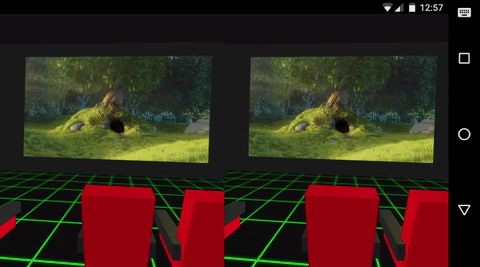

theme: ostrich,6

# Hello
## I'm Max Glenister

^ Hello, I'm Max Glenister

---
### omgmog.net
### blog.omgmog.net
### @omgmog elsewhere

^ If you know me already, it's probably through one of these places

---
## UX/Front-end Developer
### Aris Technologies
#### \(we make online casino games)

^ For my day job I design and build the UI for casino games, and the devices that make it easier for people to spend their money.

---
## Web designer/developer
### Marmalade & Jam
#### \(we mostly make websites for pubs)

^ I also run a web design company with my wife, where I mostly seem to make websites for pubs

---
## I like to
## dabble with VR

^ If I find myself with any free time I like to dabble with VR. I've been messing around with VR stuff for nearly two years now

---

### 20 minutes into the future
###[fit] with Google Cardboard and JavaScript
#### Watch it: http://omg.li/talk20mins

^ Infact, I gave a talk this time last year called "20 minutes into the future", where I explained how you can use JavaScript to make Google Cardboard experiences. If you missed it, you can check out a video and write-up at that link

---

## UX of VR
### www.uxofvr.com
^ After that I created UXofVR.com -- a curated list of articles and resources for learning/applying good UX in your VR projects. This is now considered the "go to place" for people learning about VR UX

---

## Game Dev Day
### Summer of Hacks 2016
^ Most recently, this summer for the JS Oxford Summer of Hacks, I organised Game Dev Day. I encouraged people to create VR hacks!

---
## After that...
^ So after that I was looking for another VR project to work on

---
## And then in September
^ Then in September, Ben Foxall sent me a message on the Digital Oxford Slack

---
# ...

---


^ Hey Max

---


^ Hey Ben

---


^ Do you fancy doing a month of google cardboard hacks?

---


^ Sure.

---

# Cardboctober
^ And so with two days until it began, the idea of Cardboctober was born

---
## 31 days
### of making things
### for Google Cardboard
^ The plan was simple, we would make something small for Google Cardboard each day for the month of October

---

## **EASY MODE**
### **join in sometimes**

^ We encouraged others to participate, but unsurprisingly few took part.

---

## **REGULAR MODE**
### **join in every day**

^ Ben and Pete planned to just make something each day

---

## **HARD MODE**
### **all of above & blog daily**

^ I decided it would be fun to make something and also blog about it.

---
## I made some
## cool things...

^ and I think I made some pretty cool things

---


^ Including a pairs game, a beat sequencer, and a vr cinema. I'll touch on some of these more a bit more later

---
## And so did
## other people

^ Ben and Pete also made some cool things...

---


>By @benfoxall

^ Ben's hacks were quite abstract, and I think he wrote a 3D renderer for scratch or something crazy.

---


>By @peterjwest

^ Pete's hacks were polished, and brought together some complex maths and cool interaction techniques.

---
## Check them out
### cardboctober.xyz

^ You should check them out if you didn't follow Cardboctober religiously already, all of the hacks should work in Chrome on Android on devices with a gyroscope, and will probably mostly work in Safari on iPhones

---
## How did I do it?

^ 31 days of making stuff is a lot of work. So how did I do it? Well, for me it began with a lot of planning...

---


^ I made a spreadsheet and in that broke the month down in to themed weeks, and then each week in to a project per day. This really helped stopping Cardboctober seeming like an overwhelming undertaking.

---
### Week 1
## Basic VR

^ for the first week I covered Basic VR.

---

## VR for dummies

^ Here's how you can get up and running with VR using JavaScript and Google Cardboard

---
```html
<html>
  <body>
    <script src="three.min.js"></script>
    <script>
      // !
    </script>
  </body>
</html>
```

^ First you need to create a HTML page and load three.js

---
```javascript
// Setup the camera, renderer, scene, etc.

// Make a cube
var geometry = new THREE.BoxGeometry(1, 1, 1);
var material = new THREE.MeshBasicMaterial({color: 0xff0000});
var cube = new THREE.Mesh(geometry, material);
scene.add(cube);
```

^ Then just setup your camera, renderer, scene, etc. as you do with any Three.js project. Then define a cube and add it to your scene.

---
```javascript
// Called 60 times a second using rAF
var update = function () {
  cube.rotation.x += .1;
  cube.rotation.z += .1;

  renderer.render(scene, camera);
  requestAnimationFrame(update);
};

// Call it once to begin
update();
```

^ Using request animation frame we can smoothly animate the scene, for example we could rotate the cube we've created on it's axis.

---
# Here's one I made earlier


^ Here's one I made earlier.

---
## But Max<br>that's not VR
#### That's just a spinning cube!

---


^ Oh right yes, VR needs to be 3D. So how about that? Luckily for us, three.js comes with a plugin called "stereo effect" that automatically creates a side-by-side stereoscopic view of our scene

---
```html
<html>
  <body>
    <script src="three.min.js"></script>
    <script src="StereoEffect.js"></script>
    <script>
      // !
    </script>
  </body>
</html>
```

^ Just load the StereoEffect plugin in your HTML page

---
```javascript
// After setting up your renderer
effect = new THREE.StereoEffect(renderer);
effect.eyeSeparation = 1; // Set the IPD
effect.setSize( width, height );

// Instead of calling renderer.render(scene, camera) in update()
effect.render(scene, camera)
```

^ Then initialise it after your renderer, and call it inside your update function

---


^ And that's it. That's the basics.

---
#[fit] :boom: :package: 🕶 :boom:

^ You're now a VR expert.

---
#[fit] :boom: :package: 🕶 :boom:
### blog.omgmog.net

^ Don't worry about remembering all of that, as with everything else I'm talking about this evening, you can find how to do this in more detail on the cardboctober section of my blog.

---
>Raycasting
>Skyboxes
>Textures
>Mesh generation
>Using .stl models
>and...

^ In week 1 I also covered some other things

---


^ a "match two" game.

---
### Week 2
## HTML5 Web APIs

^ For week 2 I decided to look at using Web APIs. Web browsers can do lots of cool stuff these days, such as playing video/audio without plugins and speech recognition

---
>Video
>Playing sounds
>Speech recognition
>Zombie Survival

^ So I decided to try and put some of these APIs to use

---


^ Video playback in a scene. The twist here being that I'm extracting the dominant colors from each frame and using them to light the scene. This really made my phone struggle.

---


^ Playing sounds. I made a beat sequencer using a selection of sounds. This was actually an adaptation from something I had done in 2D a couple of months ago.

---


^ Speech recognition. Using the speech recognition API, you can get a transcript of what is said and then make massive switch/case statements to use the transcript as an input.

---


^ Zombie survival. Well this wasn't so much a use of web apis -- I just got frustrated trying to make a demo that used the gamepad API, and so decided to make this instead. For two days. Reticle based movement. The zombies move towards the player and when they get too close you die.

---
### Week 3
## UX of VR

^ For the third week I focussed mainly on writing articles rather than creating demos

---


^ Because I was on holiday

---


^ In the Lake district.

---
>The UX of quick Google Cardboard experiences

---


---


---
>Getting in and out of Fullscreen
>Displaying Pertinent Information
>Moving around in VR
>Which way is North?
>One size doesn't fit all

---
### Week 4
## A big project

^ For week 4 I decided it would be a good idea to do a week-long project

---


^ So I embarked on building Tetris in VR

---


^ I figured it would be a good project as it would bring together a lot of the things I had been working on all month

---


^ Unfortunately, and perhaps appropriately I hit a wall and couldn't get past the collision detection and line storing when applying Tetris to VR.

---


^ I was over-ambitious, so I gave up on that and throw my blocks out of the pram.

---


^ and decided to do something else instead. Here's a data visualisation of my github contributions for the past year, and there's a nice chunk for October 2016.

---


^ for the last day of Cardboctober, Halloween, I build a spider from shape primitives and made it crawl around in the shadows.

---


^ look at the cute little guy!

---
## What have
## I learned?

---
## Doing something<br>every day for a<br>month is hard

---
## I've learned so much about VR and 3D

^

---
## Save time/sanity <br>by factoring out common boilerplate.

^ talk about core.js

---
## Test your ideas often, and on other people

^ It's good to get a second or third perspective. People experience things differently, what works for your eyes might not work for other people, it's hard to have a helicopter view of something you've been staring at for 3 hours late on a wednesday night.

---
## Don't worry about making it perfect

^ Needs notes: you can't be precious. so many hours in a day, other commitments, need to get it the door!

---
## If you're learning <br>from it others <br>can too

^ BLOG BLOG BLOG

---
## Try not to neglect your house duties, or your loved ones will despise VR

^ This slide originally said "don't neglect", but my wife pointed out that I'm not perfect and I may also have failed on this one.

---
# Stats

---
## Max: 31 hacks

---
> 64 Commits to main repo
> 75 Commits to /max/ repo
> ~10600 Lines of code

---
## Pete: 30 hacks

---
> 26 Commits to main repo
> 64 Commits to /pete/ repo
> ~15000 Lines of code

---
## Ben: 16 hacks

^ It turns out he's a much busier man than me.

---
> 18 Commits to main repo
> 85 Commits to /ben/ repo
> ~10000 Lines of code


---
## In conclusion...

^ It has been a really fun month, I've learned a lot and it has been a really worth-while experience. Now I'm looking forward to...

---

#[fit] Nocodevember

---
# Thanks
## Max Glenister
### omgmog.net ● @omgmog
### cardboctober.xyz

^ any questions?

