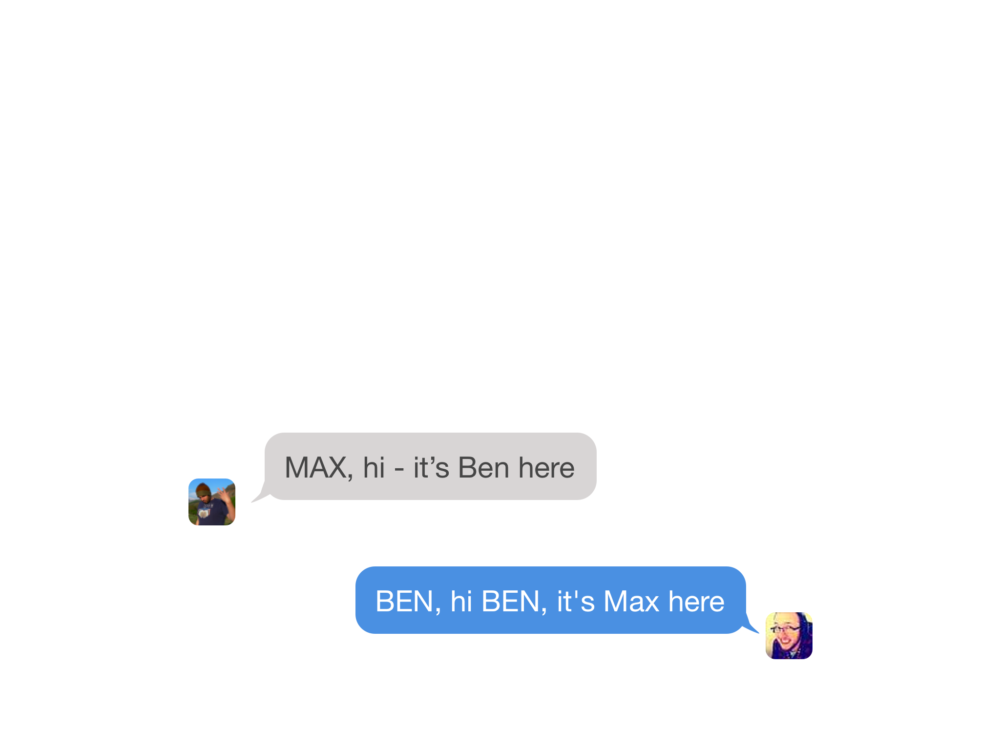
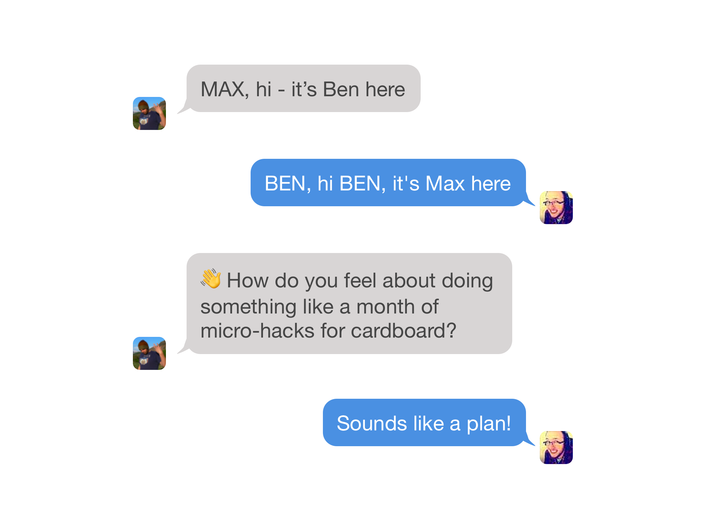
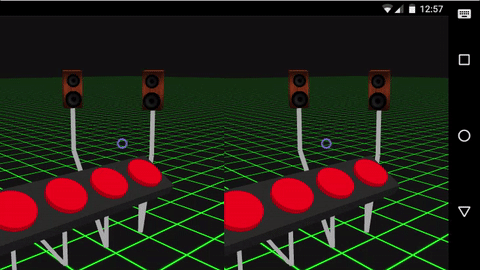

# Hello
### I'm Max Glenister

---
### omgmog.net
### blog.omgmog.net
### @omgmog elsewhere

---
## UX/Front-end Developer
### Aris Technologies
#### \(we make online casino games)

---
## Web designer/developer
### Marmalade & Jam
#### \(we mostly make websites for pubs)

---
### I like to
## dabble with VR

---

### 20 minutes into the future
###[fit] with Google Cardboard and JavaScript
#### Watch it here: https://git.io/vXtu3
^ I gave a talk this time last year called "20 minutes into the future", where I explained how you can use JavaScript to make Google Cardboard experiences

---

## UX of VR
### www.uxofvr.com
^ I created UXofVR.com -- a curated list of articles and resources for learning/applying good UX in your VR projects.

---

## Game Dev Day
### Summer of Hacks 2016
^ For the JS Oxford Summer of Hacks, I organised Game Dev Day. I encouraged people to create VR hacks using A-Frame

---
## After that...
^ I was looking for another VR project to work on

---
## And then in September

---
# ...

---

---

---

---

---

# Cardboctober

---
# 31 days
### of making things
### for Google Cardboard

---

## **EASY MODE**
### **join in sometimes**

---

## **REGULAR MODE**
### **join in every day**

---

## **HARD MODE**
### **all of above & blog daily**

---
## I made some
## cool things...

---

---
## And so did
## other people

---

>By @peterjwest

---

>By @benfoxall

---
### Check out the hacks
## cardboctober.xyz

---
## That was a
## lot of work...

---
## How did I do it?

---
# Lots of
# Planning

---
### Week 1
## Basic VR

---
// making a cube, vr input controls

---
### Week 2
## Web APIs

---
// speech recognition, audio

---
### Week 3
## UX of VR

---
// fullscreen for an immersive experience, moving around, hierarchy of needs

---

---

---
### Week 4
## Tetris in VR

---
// good week-long project
// skills we've picked up over cardboctober
// 2-dimensional array manipulation
// collision algorithms

---
## What have
## I learned?

---
// stuff
// save time by factoring out common boilerplate to save time
// test often, test on other people
// you're not creating AAA games every day, so don't worry about making it perfect
// if you're learning from it, others can too

---
## Pros

---
### Force yourself to learn something new

---
### Great for content creation

---
### Github commit streak

---
## Cons

---
### Takes a lot of time

^ 2-3 hours per day

---
### Be considerate of
### your loved ones

^ My wife had to listen to me talk about VR non-stop for a month

---

## Closing thoughts

---
// stats
// - - max/ben/pete
// - commits
// - lines of code

---
## Questions?

